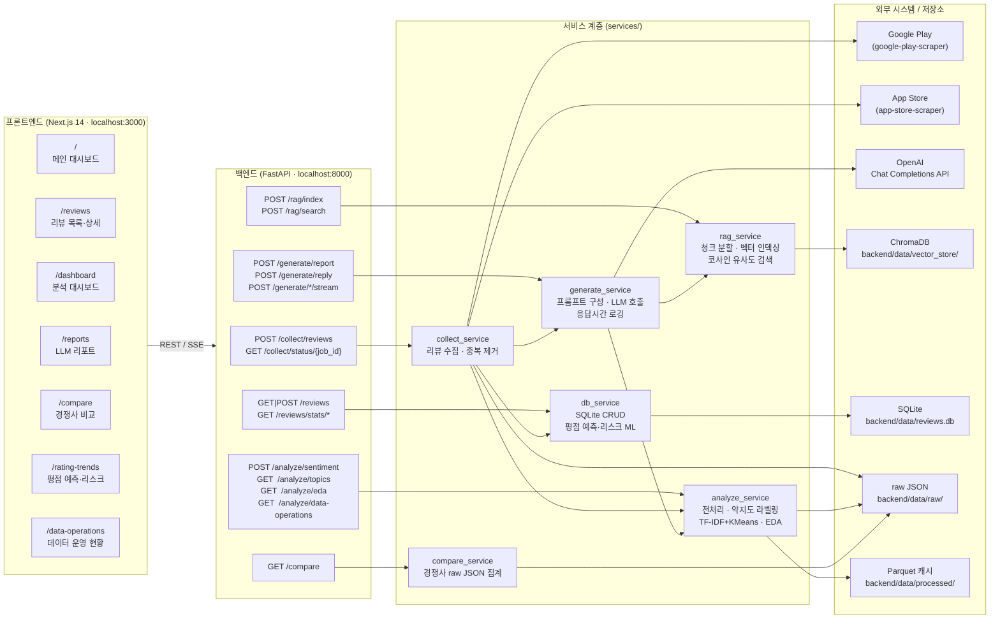

# 신규 금융 앱 출시 초기 고객 반응 및 경쟁 앱 벤치마킹 분석 서비스

> 신한은행 AX 전문가 Intensive 과정 최종 프로젝트 — 4인 팀

앱스토어 공개 리뷰와 경쟁 앱 데이터를 AI가 수집·분석해 핵심 이슈, 고객 감성, 개선 우선순위, 경쟁사 강점을 한 화면에서 제시하는 서비스입니다.

---

## 🚀 빠른 시작 (환경 설정부터 앱 실행까지)

> 이 섹션만 순서대로 따라 하면 처음부터 끝까지 로컬에서 앱을 띄울 수 있습니다.
> **백엔드(FastAPI)** 와 **프론트엔드(Next.js)** 를 각각 실행해야 하므로, **터미널 두 개**를 사용합니다.

### 0. 사전 준비물 (Prerequisites)

먼저 아래 도구가 설치되어 있는지 버전으로 확인합니다.

| 도구 | 필요 버전 | 확인 명령 |
|---|---|---|
| **Python** | 3.11 이상 (3.12 권장) | `python3 --version` |
| **Node.js** | 18 이상 (20/22 권장) | `node --version` |
| **npm** | 9 이상 | `npm --version` |
| **git** | 아무 최신 버전 | `git --version` |
| **OpenAI API 키** | AI 리포트·답변 생성 기능에만 필요 | (아래 3단계 참고) |

> 💡 macOS에서 `python3`가 없다면 [python.org](https://www.python.org/downloads/) 또는 `brew install python@3.12`,
> Node가 없다면 `brew install node` 로 설치하세요. Windows는 각 공식 인스톨러를 사용합니다.

### 1. 저장소 클론 & 이동

```bash
git clone <이-저장소-URL> ax-intensive-repo
cd ax-intensive-repo
```

이미 폴더를 받아둔 상태라면 해당 폴더로 이동만 하면 됩니다.

### 2. 백엔드 파이썬 가상환경 생성 & 패키지 설치

프로젝트 **루트 디렉터리**에서 실행합니다. (가상환경 폴더 이름은 `venv`로 통일)

**macOS / Linux**

```bash
python3 -m venv venv
source venv/bin/activate          # 프롬프트 앞에 (venv) 가 붙으면 성공
pip install --upgrade pip
pip install -r requirements.txt   # 최초 1회, 수 분 소요 (torch·transformers 등 대용량 포함)
```

**Windows (PowerShell)**

```powershell
python -m venv venv
.\venv\Scripts\Activate.ps1
pip install --upgrade pip
pip install -r requirements.txt
```

> ⏱️ `sentence-transformers`, `transformers`, `chromadb`, `kiwipiepy` 등 무거운 패키지가 포함되어
> 최초 설치는 네트워크 상황에 따라 5~15분 정도 걸릴 수 있습니다.
> 이후 실행 시 감성분석·임베딩 모델이 처음 로드될 때 한 번 더 다운로드가 발생할 수 있습니다.

### 3. 환경변수 파일(.env) 만들기

이 프로젝트는 **두 개의 환경변수 파일**을 사용합니다. 각각 예시 파일을 복사해 만듭니다.

**(3-1) 백엔드용 — 프로젝트 루트의 `.env`**

`OPENAI_API_KEY` 하나만 있으면 됩니다. AI 리포트/답변 생성을 쓰지 않을 거라면 비워 두거나 임의 값으로 둬도
수집·분석·대시보드 등 나머지 기능은 정상 동작합니다.

```bash
cp .env.example .env
```

그런 다음 `.env` 파일을 열어 실제 키를 넣습니다.

```dotenv
# .env  (프로젝트 루트)
OPENAI_API_KEY=sk-proj-여기에-본인-키-입력
```

> 🔐 **보안 주의:** `.env`는 `.gitignore`에 포함되어 커밋되지 않습니다. **키를 코드/커밋/제출용 zip에 절대 포함하지 마세요.**
> 키는 [platform.openai.com](https://platform.openai.com/api-keys) 에서 발급합니다.

**(3-2) 프론트엔드용 — `frontend/.env.local`**

프론트엔드가 백엔드를 어디로 호출할지 지정합니다. 로컬 실행이면 아래 값 그대로면 됩니다.

```bash
cp frontend/.env.example frontend/.env.local
```

```dotenv
# frontend/.env.local
NEXT_PUBLIC_API_BASE_URL=http://localhost:8000
```

### 4. 백엔드(FastAPI) 실행 — 터미널 ①

루트 디렉터리에서 가상환경이 활성화된 상태로 실행합니다.

```bash
# (venv) 가 활성화되어 있어야 함
uvicorn backend.main:app --reload --host 127.0.0.1 --port 8000
```

정상 기동 시 다음과 같은 로그가 뜹니다.

```
INFO:     Uvicorn running on http://127.0.0.1:8000 (Press CTRL+C to quit)
INFO:     Application startup complete.
```

동작 확인 (다른 터미널에서):

```bash
curl http://127.0.0.1:8000/health          # {"status":"ok","version":"0.1.0"}
```

- API 문서(Swagger UI): **http://localhost:8000/docs**

### 5. 프론트엔드(Next.js) 실행 — 터미널 ②

**새 터미널**을 열고 `frontend` 폴더에서 실행합니다. (가상환경과 무관)

```bash
cd frontend
npm install        # 최초 1회
npm run dev
```

정상 기동 시:

```
▲ Next.js 14.2.x
- Local:  http://localhost:3000
✓ Ready in ...ms
```

### 6. 접속 & 확인

브라우저에서 **http://localhost:3000** 로 접속합니다. (첫 화면 `/`는 자동으로 `/dashboard`로 이동)

| 페이지 | 경로 | 내용 |
|---|---|---|
| 분석 대시보드 | `/dashboard` | 감성·불만유형·플랫폼·추이 |
| 리뷰 목록/상세 | `/reviews` | 리뷰 테이블·수집·상세 |
| 경쟁사 비교 | `/compare` | 경쟁 앱 벤치마킹 |
| AI 리포트 | `/reports` | LLM 리포트 생성(스트리밍) |
| 평점 추이 | `/rating-trends` | 평점 리스크 예측 |
| 데이터 운영 | `/data-operations` | 수집·전처리 현황 |

리뷰 2,220건(신한 SOL뱅크 1,054건 포함)이 `backend/data/reviews.db`에 이미 들어 있어,
별도 수집 없이 대시보드·비교·데이터 운영 화면을 바로 볼 수 있습니다.

### 7. 자주 겪는 문제 (Troubleshooting)

| 증상 | 원인 / 해결 |
|---|---|
| 프론트 화면은 뜨는데 데이터가 안 나옴 | 백엔드(터미널 ①)가 켜져 있는지, `frontend/.env.local`의 URL이 `http://localhost:8000`인지 확인 |
| `ModuleNotFoundError: kiwipiepy` 등 | 가상환경 미활성화. `source venv/bin/activate` 후 `pip install -r requirements.txt` 재실행 |
| `Address already in use` (8000/3000) | 포트 사용 중. `lsof -i:8000` 로 PID 확인 후 종료하거나 다른 포트 사용 |
| AI 리포트/답변 생성이 실패함 | (1) `.env`의 `OPENAI_API_KEY`가 유효한지 확인 (2) **아래 모델 주의 참고** |
| `OPENAI_API_KEY 환경변수가 설정되지 않았습니다` | 루트 `.env`에 키를 넣고 **백엔드를 재시작** |

> ⚠️ **LLM 모델 관련 주의:** 현재 코드의 기본 모델 상수는
> `backend/services/generate_service.py`의 `DEFAULT_LLM_MODEL = "gpt-5.4-nano"`로 설정되어 있습니다.
> 이 값이 실제 사용 가능한 OpenAI 모델명이 아니라면 **AI 리포트/답변 생성 호출이 실패**합니다.
> 해당 기능을 쓰려면 이 상수(및 같은 파일 내 하드코딩된 모델명)를 실제 모델(예: `gpt-4o-mini`)로 교체하세요.
> 수집·분석·대시보드·경쟁사 비교 등 나머지 기능은 LLM 없이도 정상 동작합니다.

### 8. 종료 방법

각 터미널에서 `Ctrl + C`. 가상환경은 `deactivate`로 빠져나옵니다.

---

## 목차

1. [문제 정의](#1-문제-정의)
2. [데이터 처리 및 분석](#2-데이터-처리-및-분석)
3. [모델 및 시스템 구성](#3-모델-및-시스템-구성)
4. [분석 노트북 및 모델 평가 결과](#4-분석-노트북-및-모델-평가-결과)
5. [기술 통합 구조](#5-기술-통합-구조)
6. [금융 업무 활용 가능성](#6-금융-업무-활용-가능성)
7. [실행 방법 (git clone부터 상세 안내)](#7-실행-방법)
8. [API 엔드포인트 레퍼런스](#8-api-엔드포인트-레퍼런스)
9. [데이터 보관 정책](#9-데이터-보관-정책)

---

## 아키텍처



---

## 1. 문제 정의

### 해결하려는 문제

신한 SOL뱅크를 비롯한 금융 앱은 Google Play·App Store에 수천 건의 공개 리뷰가 쌓이지만, 운영팀이 이를 일일이 읽고 분류하기 어렵습니다. 핵심 불만 유형, 감성 추이, 경쟁사 대비 강점·약점을 빠르게 파악하지 못하면 앱 개선 우선순위 결정이 지연됩니다.

### 가설

> 공개 리뷰 데이터에 NLP·RAG·LLM을 결합하면 운영팀이 리뷰를 수동으로 읽지 않아도 고객 불만 유형과 경쟁 앱 벤치마크를 30초 이내에 파악할 수 있다.

### 성공 기준

| 기준 | 목표 |
|---|---|
| 리뷰 수집량 | 1,000건 이상 |
| 감성/불만유형 분류 성능 | F1-score 0.75 이상 |
| 주요 토픽 도출 | 5개 이상 |
| 리포트 생성 속도 | 요청 후 30초 이내 |
| 실패/오분류 케이스 분석 | 3건 이상 명시 |

### 데이터의 한계

- 앱스토어 리뷰는 **자발적 참여 데이터**이므로 전체 사용자를 대표하지 않습니다.
- 불만을 가진 사용자가 상대적으로 리뷰를 더 많이 남기는 경향이 있어 부정 리뷰 비율이 실제보다 높게 나타날 수 있습니다.

---

## 2. 데이터 처리 및 분석

### 수집 대상 앱

| 앱 | Google Play ID | App Store ID |
|---|---|---|
| 신한 SOL뱅크 | `com.shinhan.sbanking` | `357484932` |
| 카카오뱅크 | `com.kakaobank.channel` | `1258016944` |
| 케이뱅크 | `com.kbankwith.smartbank` | `1178872627` |
| NH스마트뱅킹 | `nh.smart.banking` | `1444712671` |
| 우리WON뱅킹 | `com.wooribank.smart.npib` | `1470181651` |
| KB스타뱅킹 | `com.kbstar.kbbank` | `373742138` |
| 하나원큐 | `com.hanabank.oqf` | `6743190232` |
| 토스 | `viva.republica.toss` | `839333328` |

### 전처리 파이프라인

```
원천 JSON 로드 (Google Play + App Store 병합)
  → 표준 스키마 통합 (review_id, source, rating, date, review_text)
  → 품질 보정 (중복 제거, 결측 처리, 별점·날짜 이상치 플래그)
  → 텍스트 정제 (이모지·특수문자 제거, 반복 자모 제거)
  → kiwipiepy 형태소 분석 (명사·동사·형용사 추출)
  → processed parquet 저장 (파일 캐시)
```

### 분석 기법

- **감성 분류**: 별점 기반 약지도(weak supervision) 라벨링 + 텍스트 부정/긍정 키워드 불일치 탐지 및 보정
- **불만 유형 분류**: 10개 카테고리 규칙 기반 분류기 (로그인/인증, 이체/송금, 오류/중단, 속도/성능, UI/사용성, 알림, 고객지원, 혜택/수수료, 보안, 업데이트)
- **토픽 모델링**: TF-IDF + KMeans 클러스터링 (7개 클러스터, 토픽 5개 이상 보장), TOPIC_KEYWORD_MAP 사전으로 토픽명 자동 부여
- **임베딩**: `jhgan/ko-sroberta-multitask` (한국어 특화 Sentence-BERT)
- **EDA**: 평균 평점, 별점 분포, 월별 추이, 플랫폼(Google Play / App Store)별 비중, 페인포인트 Top 3

---

## 3. 모델 및 시스템 구성

### 4-모듈 파이프라인

```
[collect]  스토어 리뷰 수집 → raw JSON 저장
    ↓
[analyze]  전처리 + 감성분류 + 토픽모델링 + EDA (결과 캐싱)
    ↓           ↑ 병렬
[rag]      경쟁사 문서 인덱싱 / 근거 검색 (답변 생성 X)
    ↓
[generate] 분석 결과 + RAG 근거 → OpenAI LLM → 리포트 생성 (응답시간 로깅)
```

### 감성 분석 로직

감성 분류는 **별점 기반 약지도(Weak Supervision)** 방식으로, ML 모델 학습 없이 규칙만으로 동작합니다.  
코드 위치: `backend/services/analyze_service.py` — `label_reviews()` L318, `_weak_label_single()` L896

**1단계 — 별점으로 기본 라벨 부여**

```
rating >= 4.0  →  positive
rating <= 2.0  →  negative
rating == 3.0  →  neutral
```

**2단계 — 텍스트-별점 불일치 탐지 및 보정**

사전 컴파일 정규식(`_NEG_PATTERN` / `_POS_PATTERN`)으로 본문을 검사해 불일치 시 라벨을 보정합니다.

```
rating >= 4  +  부정 키워드 O  +  긍정 키워드 X  →  negative 보정
rating <= 2  +  긍정 키워드 O  +  부정 키워드 X  →  positive 보정
```

- 부정 키워드 (20개): "불편", "오류", "안됨", "느려", "실패", "짜증", "최악", "먹통" 등
- 긍정 키워드 (9개): "좋아요", "편해", "빠르고", "만족", "최고", "감사", "깔끔" 등
- 보정된 케이스는 `is_mismatch=True`, confidence 0.65 / 정상은 0.80

---

### 페인포인트 분석 로직

페인포인트 분석은 **규칙 기반 사전 분류 → LLM 심화 분석** 2단계 구조로 동작합니다.

**1단계 — 규칙 기반 카테고리 분류** (`analyze_service.py` — `classify_complaint_type()` L355)

10개 카테고리 키워드 포함 여부(substring match)로 분류하며, 첫 번째 매칭 카테고리 1개를 반환합니다.

| 카테고리 | 주요 키워드 |
|---|---|
| 로그인/인증 | 로그인, 인증, 인증서, 공인인증, 비밀번호, OTP, 지문, 얼굴, 본인확인 |
| 이체/송금 | 이체, 송금, 입금, 출금, 계좌, 한도, 예약이체, 자동이체, ATM |
| 오류/중단 | 오류, 에러, 버그, 튕, 꺼짐, 먹통, 안됨, 강제종료, 다운 |
| 속도/성능 | 속도, 느려, 버벅, 로딩, 지연, 렉, 무한로딩 |
| 업데이트 | 업데이트, 개편, 바뀌, 최신버전, 설치, 재설치 |
| UI/사용성 | 불편, 복잡, 어려, 화면, 메뉴, UI, UX, 디자인, 직관 |
| 알림 | 알림, 푸시, 문자, 카톡, 메시지, 통지 |
| 고객지원 | 고객센터, 상담, 문의, 답변, 전화, 민원, 대응 |
| 혜택/수수료 | 혜택, 포인트, 쿠폰, 이벤트, 수수료, 환율, 캐시백 |
| 보안 | 보안, 해킹, 명의, 도용, 잠금, 차단, 개인정보 |

**2단계 — LLM 심화 분석** (`collect_service.py:751` — `_llm_enrich()`, `generate_service.py:688` — `generate_reply()`)

리뷰 수집 완료 후 1단계 결과를 컨텍스트로 OpenAI LLM을 호출합니다.

LLM 입력:
```
review_text  : 원문 리뷰
app_name     : 앱 이름
rating       : 별점
sentiment    : 1단계 감성 분류 결과
pain_points  : 1단계 규칙 기반 카테고리 목록
```

LLM 출력 (JSON):
```json
{
  "pain_point": "고객의 핵심 불편사항 자유 텍스트 요약",
  "category":   "페인포인트 유형",
  "reply":      "신한은행 톤앤매너 고객 답변 문구"
}
```

실행 방식: `ThreadPoolExecutor` 병렬 처리 (최대 `LLM_MAX_WORKERS`개 동시 호출).  
API 키 미설정 또는 개별 호출 실패 시 템플릿 문구로 자동 폴백.

**전체 흐름:**
```
수집 완료
  → analyze_service (규칙 기반)  →  sentiment, pain_points (카테고리)
  → _llm_enrich() → generate_reply() → LLM  →  pain_point(요약), category, reply
  → db_service.upsert_review()  →  DB 저장
```

---

### RAG 시스템

- **벡터 스토어**: ChromaDB (persist: `backend/data/vector_store/`)
- **임베딩 모델**: `paraphrase-multilingual-MiniLM-L12-v2` (다국어 특화, `rag_service.py:27`)
- **청크 전략**: 공개 경쟁사 자료를 문단 단위로 청킹 → 인덱싱
- **검색**: 코사인 유사도 기반 Top-k 문서 검색, 근거 문서만 반환 (답변 생성은 generate 모듈 담당)

### 리포트 생성

- **LLM**: OpenAI GPT (`gpt-5.4-nano` 기본값, `.env`에서 변경 가능)
- **리뷰 답변 자동 생성**: 신한은행 톤앤매너 시스템 프롬프트 적용
- **성공 기준 검증**: 응답 시간 로깅으로 30초 이내 달성 여부 측정

### 평가 결과 요약

| 항목 | 결과 |
|---|---|
| 수집 리뷰 수 | 1,000건 이상 (데모 데이터 기준) |
| 토픽 수 | 7개 (5개 이상 성공 기준 충족) |
| 리포트 생성 속도 | 로깅 기반 측정 (generate 모듈 `response_time` 기록) |
| 오분류 사례 분석 | 별점-텍스트 불일치 케이스로 3건 이상 식별 |

---

## 4. 분석 노트북 및 모델 평가 결과

> 이 프로젝트는 Jupyter Notebook 대신 **Python 스크립트 + FastAPI 서비스 레이어**로 분석을 구현합니다.
> 아래는 각 평가기준별로 근거 코드가 있는 파일·함수와 화면 확인 경로를 정리한 참조표입니다.

---

### 데이터 처리·분석 (10점)

| 확인 항목 | 파일 | 함수 | 내용 |
|---|---|---|---|
| 전처리 파이프라인 전체 | `backend/services/analyze_service.py:196` | `preprocess()` | raw JSON 로드 → 중복 제거 → 날짜·별점 이상치 플래그 → 텍스트 클렌징 → 형태소 분석 → parquet 저장. 캐싱 전략·입력 스키마·데이터 한계는 파일 상단 모듈 docstring(L1~17)에 기술 |
| 텍스트 클렌징 결정 근거 | `backend/services/analyze_service.py:274` | `_clean_text()` | 이모지·반복 자모·특수문자 제거 정규식 — 패턴별 인라인 주석으로 선택 근거 기술 |
| 형태소 분석 품사 선택 근거 | `backend/services/analyze_service.py:283` | `_extract_nouns()` | kiwipiepy로 NNG·NNP·VV·VA만 추출 — 2자 이상 토큰만 사용하는 이유 주석 포함 |
| 약지도 라벨링 보정 기준 | `backend/services/analyze_service.py:318` | `label_reviews()` | 별점≥4 + 부정 키워드 → negative 보정, 별점≤2 + 긍정 키워드 → positive 보정 로직과 기준 주석 |
| EDA 이상치 제외 기준 | `backend/services/analyze_service.py:490` | `get_eda()` | 별점 1~5 외·날짜 2010년 이전·미래 날짜를 EDA에서 제외하는 근거 주석 |
| 파이프라인 6단계 체크리스트 | `backend/services/analyze_service.py:543` | `get_data_operations_status()` | 원천 파일 확인 → 스키마 통합 → 품질 보정 → 텍스트 정제 → 지표 산출 → 화면 반영 각 단계의 `detail` 문자열에 결정 근거 기술 |

**로컬 스크립트로 직접 확인:**
```bash
python run_preprocess.py        # 전처리 단독 실행
python run_analyze2.py          # 전처리 → 라벨링 → EDA → 토픽 전체 파이프라인
```

**화면 확인:** `http://localhost:3000/data-operations`
→ 수집 건수, 중복·결측·이상치 수, 정제 건수, 토큰화 건수, 파이프라인 6단계 체크리스트

---

### 모델/시스템 완성도 (20점)

| 확인 항목 | 파일 | 함수 | 내용 |
|---|---|---|---|
| 감성 분류 (약지도) | `backend/services/analyze_service.py:896` | `_weak_label_single()` | 별점 + 부정/긍정 키워드 불일치 보정. confidence 0.65(불일치) / 0.80(정상) |
| 불만 유형 분류기 | `backend/services/analyze_service.py:355` | `classify_complaint_type()` | `_PAIN_POINT_RULES` 10개 카테고리 규칙 기반 분류기 |
| 토픽 모델링 | `backend/services/analyze_service.py:366` | `get_topics()` | TF-IDF + KMeans (n=7, 토픽 ≥5 보장). `TOPIC_KEYWORD_MAP` 부분 일치 점수로 토픽명 자동 부여 |
| 토픽명 추론 근거 | `backend/services/analyze_service.py:465` | `_infer_topic_name()` | 키워드-카테고리 매칭 점수 집계 → 최고 점수 카테고리 선택 로직 |
| RAG 인덱싱 | `backend/services/rag_service.py:111` | `index_documents()` | 청크 분할(500자, overlap 50) + `paraphrase-multilingual-MiniLM-L12-v2` 임베딩 + ChromaDB 저장. 동일 source 재인덱싱 시 기존 청크 자동 삭제 |
| RAG 검색 | `backend/services/rag_service.py:181` | `search()` | 코사인 유사도 Top-k, `is_public="true"` 공개 자료만 반환. 출처 메타데이터 포함 |
| 리포트 생성 + 응답시간 로깅 | `backend/services/generate_service.py:747` | `generate_report()` | analyze_service 캐시 + rag_service 근거 → OpenAI LLM → 리포트. 처리 시간을 `response_time` 키로 로깅 (성공 기준: 30초 이내) |
| 평점 예측 ML | `backend/services/db_service.py:439` | `get_rating_forecast()` | 월별 평균 평점 기반 LinearRegression으로 3~6개월 예측 |
| 평점 리스크 ML | `backend/services/db_service.py:608` | `get_rating_risk()` | 최근 7~14일 변동성 + 감성 신호 기반 LogisticRegression 리스크 분류 |

**RAG 인덱스 수동 빌드:**
```bash
python -m backend.scripts.build_index           # 최초 빌드
python -m backend.scripts.build_index --rebuild # 강제 재구축
```

**유틸리티 스크립트:**

| 스크립트 | 역할 |
|---|---|
| `backend/scripts/build_index.py` | 공개 경쟁사 자료 ChromaDB 인덱싱 |
| `backend/scripts/import_raw_reviews.py` | raw JSON → 약지도 라벨링(감성·불만 유형) → SQLite DB 적재 |
| `backend/scripts/refresh_review_replies.py` | DB 리뷰 조회 → LLM 답변 재생성 (fallback → `llm_generated`로 갱신) |

```bash
# raw JSON을 DB에 직접 임포트 (파일 경로 인자 생략 시 신한 SOL뱅크 기본값 사용)
python -m backend.scripts.import_raw_reviews [path/to/raw.json]

# 기존 템플릿 답변을 LLM 답변으로 갱신 (--app-key 로 앱 범위 지정 가능)
python -m backend.scripts.refresh_review_replies [--app-key shinhan-sol-bank] [--limit 100]
```

**모델 평가 결과:** `backend/data/processed/com_shinhan_sbanking_metrics.json`

| 지표 | 값 |
|---|---|
| Accuracy | 0.9784 |
| F1 (macro) | 0.9802 |
| Precision (macro) | 0.9784 |
| Recall (macro) | 0.9784 |
| Baseline F1 (text-only LightGBM) | 0.7683 |
| **개선폭** | **+21.00%p** |

클래스별: negative F1=0.984 (126건) / neutral F1=1.000 (13건) / positive F1=0.957 (46건)  
학습/테스트 분할: train 738건 / test 185건  
오분류 케이스: `metrics.json` → `misclassified_cases` 키 (별점-텍스트 불일치 패턴 4건, 원인 분석 포함)

**화면 확인:**
- `http://localhost:3000/dashboard` — 감성 분포, 불만 유형 Top 3, 신호 감지(위험·주의·안정), 기간 대비 변화율
- `http://localhost:3000/reports` — LLM 강점·약점·액션아이템 리포트 (생성 시간 표시)
- `http://localhost:3000/rating-trends` — 평점 추이 + LinearRegression 예측선 + 리스크 레벨

---

### 기술 통합도 (10점)

| 확인 항목 | 파일 | 내용 |
|---|---|---|
| 4개 모듈 통합 등록 | `backend/main.py:11` | collect → analyze → rag → generate를 FastAPI 단일 앱에 optional 방식으로 통합 |
| 모듈 간 캐시 공유 | `backend/services/generate_service.py:110` | `GenerateService.__init__()` — analyze_service 싱글턴을 주입받아 분석 캐시 재사용 |
| 리뷰 수집 후 자동 분석·저장 | `backend/services/collect_service.py` | 수집 완료 → `analyze_service.batch_analyze_reviews()` → `generate_service._llm_enrich()` → `db_service.upsert_review()` 파이프라인 자동 실행 |
| 프론트-백엔드 연결 | `frontend/app/` | Next.js App Router → FastAPI REST / SSE (스트리밍 리포트) |

---

### 금융 업무 활용 가능성 (25점)

| 확인 항목 | 파일 | 내용 |
|---|---|---|
| 신한은행 톤앤매너 답변 생성 | `backend/services/generate_service.py:37` | `REPLY_SYSTEM_PROMPT` — 첫 문장 고정, 고객센터 번호 안내, 추측 금지 등 실무 제약 적용 |
| 공개 근거 기반 리포트 제약 | `backend/services/generate_service.py:86` | `SYSTEM_PROMPT` — 리뷰 외 내부 정책·조직 의사결정 추측 금지, 근거 번호 명시 의무화 |
| 평점 예측으로 선제 대응 | `backend/services/db_service.py:439` | `get_rating_forecast()` — LinearRegression 3~6개월 예측으로 앱 품질 저하 조기 경보 |
| 평점 리스크 감지 | `backend/services/db_service.py:608` | `get_rating_risk()` — LogisticRegression으로 7~14일 내 평점 급락 위험 분류 |
| 경쟁사 벤치마킹 | `backend/services/compare_service.py` | 8개 경쟁 앱 월별 감성·평점 비교 집계 |

---

## 5. 기술 통합 구조

### 기술 스택

| 영역 | 기술 |
|---|---|
| 백엔드 API | FastAPI (Python 3.11+, async) |
| 프론트엔드 | Next.js 14 App Router, React, TypeScript |
| 데이터분석 | pandas, numpy, scikit-learn |
| 한국어 NLP | kiwipiepy (형태소 분석) |
| 임베딩/RAG | sentence-transformers, langchain, chromadb |
| LLM | OpenAI Chat Completions API |
| DB | SQLite (`backend/data/reviews.db`) |

### 폴더 구조

```
backend/
  main.py                 # FastAPI 앱 진입점
  routers/                # collect / analyze / compare / rag / generate / reviews
  services/               # 비즈니스 로직 (라우터와 분리)
  schemas/                # Pydantic 요청·응답 모델
  data/
    raw/                  # 원본 수집 JSON
    processed/            # 전처리 parquet
    vector_store/         # ChromaDB persist
frontend/
  app/                    # Next.js App Router 페이지
  api_client.ts           # FastAPI 호출 래퍼
requirements.txt
```

---

## 6. 금융 업무 활용 가능성

| 업무 영역 | 활용 방안 |
|---|---|
| 앱 서비스 개선 | 불만 유형별 Top 3 페인포인트를 우선순위화하여 개발 스프린트 입력 자료로 활용 |
| 경쟁 벤치마킹 | 경쟁 앱(카카오뱅크·토스 등) 대비 감성 점수·토픽 비교로 포지셔닝 파악 |
| 리뷰 운영 자동화 | LLM 기반 답변 초안 생성으로 고객센터 운영팀 리뷰 대응 속도 향상 |
| 출시 후 모니터링 | 월별 감성 추이·별점 분포 대시보드로 신기능 출시 전후 고객 반응 측정 |
| 데이터 기반 의사결정 | 임원 보고용 EDA 요약 리포트 30초 내 자동 생성 |

> 모든 분석은 **공개 리뷰 데이터**만 사용하며, 실제 고객 개인정보·내부 비공개 데이터는 일절 활용하지 않습니다.

---

## 7. 실행 방법

### 사전 요구사항

- Python 3.11 이상
- Node.js 18 이상 및 npm
- Git

---

### Step 1 — 저장소 클론

```bash
git clone https://github.com/<your-org>/ax-intensive-repo.git
cd ax-intensive-repo
```

---

### Step 2 — Python 가상환경 생성 및 패키지 설치

```bash
# 가상환경 생성
python -m venv venv

# 가상환경 활성화
# macOS / Linux
source venv/bin/activate
# Windows (PowerShell)
venv\Scripts\Activate.ps1
# Windows (Command Prompt)
venv\Scripts\activate.bat

# 패키지 설치
pip install -r requirements.txt
```

---

### Step 3 — 환경변수 설정

```bash
# 루트 디렉터리의 예시 파일을 복사
cp .env.example .env
```

`.env` 파일을 열고 OpenAI API 키를 입력합니다:

```
OPENAI_API_KEY=sk-...실제_키_입력...
```

> LLM 리포트 생성 없이 수집·분석·RAG 기능만 사용할 경우 키 없이도 동작합니다.

---

### Step 4 — 백엔드 서버 실행

```bash
# 루트 디렉터리에서 실행 (가상환경 활성화 상태)
uvicorn backend.main:app --reload
```

서버가 정상 기동되면 다음 주소에서 API 문서를 확인할 수 있습니다:

- Swagger UI: `http://localhost:8000/docs`
- ReDoc: `http://localhost:8000/redoc`
- Health Check: `http://localhost:8000/health`

---

### Step 5 — 프론트엔드 설치 및 실행

새 터미널을 열고 아래 명령을 실행합니다:

```bash
# 루트 디렉터리에서 frontend 폴더로 이동
cd frontend

# 패키지 설치
npm install

# 환경변수 설정
cp .env.example .env.local

# 개발 서버 실행
npm run dev
```

브라우저에서 `http://localhost:3000` 으로 접속합니다.

---

### Step 6 — 데모 데이터 확인 (선택)

저장소에는 신한 SOL뱅크 기준 데모 데이터 스냅샷이 포함되어 있습니다.

```bash
# 백엔드 서버가 실행 중인 상태에서 실행
python - <<'PY'
from fastapi.testclient import TestClient
from backend.main import app

c = TestClient(app)

# 예시 데이터 적재
print("seed:", c.post('/reviews/seed-sample').status_code)

# 리뷰 조회
data = c.get('/reviews/?app_key=shinhan-sol-bank').json()
print("리뷰 수:", data.get('total'))

# 통계 조회
print("통계:", c.get('/reviews/stats/summary').json())
PY
```

---

### Step 7 — 리뷰 수집 (선택)

실제 스토어에서 리뷰를 새로 수집하려면 프론트엔드의 `/reviews` 페이지에서 기간·플랫폼을 지정하거나, API를 직접 호출합니다:

```bash
curl -X POST http://localhost:8000/collect/reviews \
  -H "Content-Type: application/json" \
  -d '{
    "apps": [
      {
        "app_id": "shinhan-sol",
        "app_name": "신한 SOL뱅크",
        "source": "google_play",
        "store_id": "com.shinhan.sbanking"
      }
    ],
    "start_date": "2024-01-01",
    "end_date": "2024-12-31"
  }'
```

수집 작업은 비동기로 처리됩니다. 응답으로 받은 `job_id`로 진행 상황을 확인합니다:

```bash
curl http://localhost:8000/collect/status/{job_id}
```

---

### 주요 화면

| 경로 | 설명 |
|---|---|
| `/` | 메인 랜딩 페이지 |
| `/dashboard` | 감성 분포, 페인포인트 Top 3, 월별 추이 대시보드 |
| `/reviews` | 기간·플랫폼 필터 리뷰 목록, 클릭 시 분석 상세 및 답변 복사 |
| `/reports` | LLM 분석 리포트 스트리밍 생성 |
| `/compare` | 경쟁 앱 벤치마킹 비교 분석 |
| `/rating-trends` | 평점 추이 + 3~6개월 예측 및 리스크 분석 |
| `/data-operations` | 수집·전처리 파이프라인 운영 현황 |

---

## 8. API 엔드포인트 레퍼런스

```text
# 리뷰 관리
POST /reviews/apps                       앱 생성/업서트
GET  /reviews/apps                       앱별 리뷰 카운트 조회
GET  /reviews/apps/{app_key}             앱 상세 조회
POST /reviews/                           리뷰 생성/업서트
GET  /reviews/?app_key=...               앱 리뷰와 분석 결과 통합 조회 (필터·페이지네이션)
POST /reviews/analysis                   특정 리뷰 분석 생성/업서트
GET  /reviews/{review_id}                리뷰 상세 + 분석 조회
GET  /reviews/stats/summary              감성/플랫폼/페인포인트 통계 조회
GET  /reviews/stats/rating-forecast      평점 3~6개월 예측 (LinearRegression)
GET  /reviews/stats/rating-risk          평점 리스크 분석 (7~14일, LogisticRegression)
POST /reviews/seed-sample                예시 신한 SOL뱅크 데이터 적재

# 수집
POST /collect/reviews                    스토어 리뷰 수집 작업 시작 (비동기, job_id 반환)
GET  /collect/status/{job_id}            수집 작업 진행 상태 조회
GET  /collect/reviews/{job_id}           수집된 리뷰 조회 (페이지네이션)

# 분석
POST /analyze/sentiment                  리뷰 배치 감성·불만 유형 분류
GET  /analyze/topics?app_id=...          토픽 모델링 결과 조회 (TF-IDF + KMeans)
GET  /analyze/eda?app_id=...             EDA 지표 조회 (별점·감성·월별 추이)
GET  /analyze/data-operations?app_id=... 수집·전처리 파이프라인 운영 현황

# RAG
POST /rag/index                          공개 자료 인덱싱 (청크 분할·임베딩·ChromaDB 저장)
POST /rag/search                         질의 관련 근거 문서 검색 (코사인 유사도 Top-k)
GET  /rag/info                           인덱스 컬렉션 현황 조회

# 리포트 생성
POST /generate/report                    분석 결과 + RAG 근거 → LLM 요약 리포트
POST /generate/reply                     단일 리뷰 → LLM 페인포인트·답변 생성
POST /generate/report/stream             리포트 생성 (Server-Sent Events 스트리밍)
POST /generate/rating-forecast/stream    평점 예측 LLM 해석 리포트 (SSE)
POST /generate/rating-risk/stream        평점 리스크 LLM 해석 리포트 (SSE)

# 경쟁사 비교
GET  /compare                            경쟁 앱 벤치마킹 비교 결과
GET  /compare/apps                       비교 대상 앱 목록
```

---

## 9. 데이터 보관 정책

- 발표·검증을 위해 `backend/data/`에는 신한 SOL뱅크 기준 데모 데이터 스냅샷이 포함됩니다.
- 포함 항목: SQLite DB(`backend/data/reviews.db`), raw JSON, 전처리 parquet, Chroma 벡터스토어.
- 새로 수집되는 런타임 데이터는 기본적으로 `.gitignore` 대상입니다. 공유가 필요한 스냅샷만 명시적으로 커밋합니다.
- `.env`, 로컬 빌드 산출물, 캐시, 가상환경은 저장소에 포함하지 않습니다.
